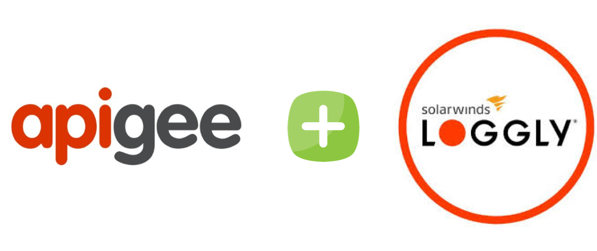

# Apigee Edge - External Message Logging to Loggly


## About
This API proxy demonstrates message logging to Loggly.

The objective of creating this repository to help Apigee developers to QuickStart with logging with Loggly.   

## Prerequisite
- Apigee edge account
- Loggly Account
- Loggly Customer Token - https://www.loggly.com/docs/customer-token-authentication-token/

## Optional
- postman (to run postman collection)
- NodeJS (for newman and apigeetool)
- newman (node JS module to execute tests on local machine)
- apigeetool (deploying this proxy to Apigee edge)

## How to use it

### 1. Deploy API proxy to Apigee Edge
You can use either of the option mentioned below;
##### option 1: using `apigeetool`
You can deploy this API proxy by calling this command.

```bash
apigeetool deployproxy  -u {apigee_edge_account_email} -o {apigee_edge_org_name}  -e {environment_name} -n {proxy_name} -d . --verbose --debug
```
example; 
```bash
apigeetool deployproxy  -u kuldeep.bhati@devoteam.com -o abccorp-nonprod  -e test -n hello-world-loggly-logging -d . --verbose --debug
```
For more information about `apigeetool` read here - https://www.npmjs.com/package/apigeetool

##### option 2: uploading a zip to apigee edge

1. Create a bundle zip file with below command;
```bash 
zip -r apiproxy.zip apiproxy
```

2. Upload it to apigee edge using proxy creation wizard.
Make sure it is deployed before testing.

### 2. Test
You can make some sample call to the API proxy;
```bash
curl -X GET \
  {PROXY_END_POINT}/v1/hello-world-loggly-logging/json \
  -H 'Accept: application/json'
```


## Unit Test (Optional)
Set the `proxy_endpoint` in [tests/test.postman_environment.json](tests/test.postman_environment.json) file before executing the command below.

You can test this API proxy by calling this command.
```bash
newman run "tests/apiproxy.postman_collection.json" -e "tests/test.postman_environment.json"
```

## Issues, questions and feedback
https://github.com/bhatikuldeep/hello-world-loggly-logging/issues

## Some Tips
- `request.content` and `response.content` are not avaiable in PostClientFlow, therefore with this example you can not capture request/response; however if it is a requirement, you can use Assign Message to capture request/response and store in a variable and use that variable in Message Logging. Just a small note, since PostClientFlow is executed after the response is sent to the API consumer, putting request/response with Assign Message will add some latency and might impact the performance of your API.

